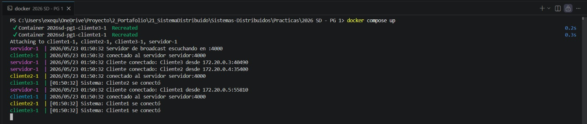
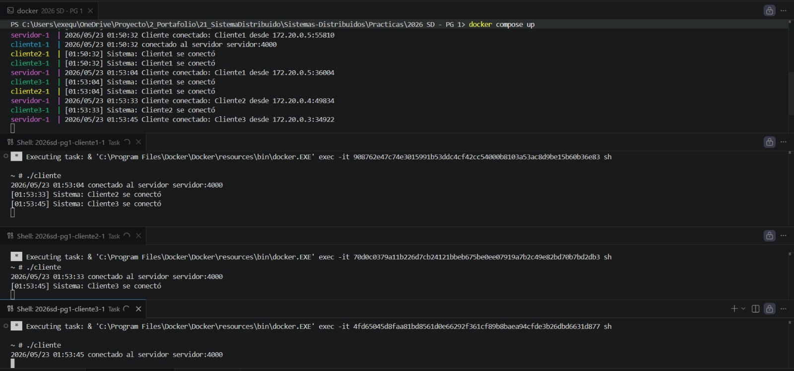
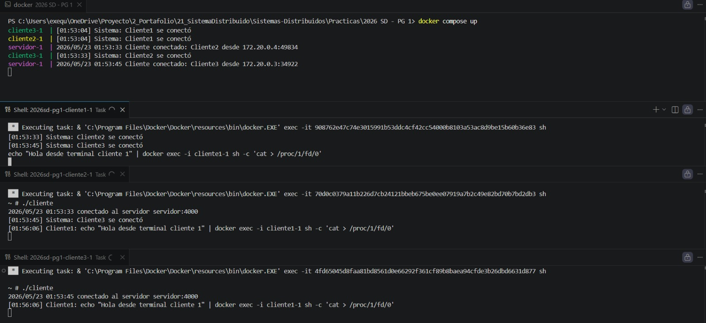
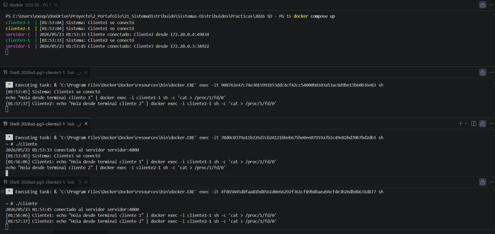
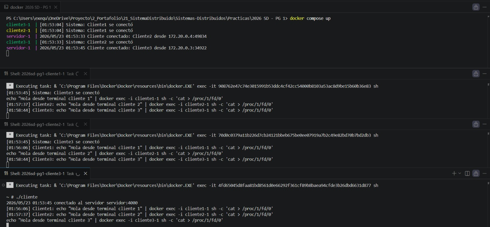

# Servidor de Broadcast Concurrente

Proyecto base para la Clase sobre Sockets de Sistemas Distribuidos.

## Integrantes

- Pavón, Juan Gabriel
- Ruthlein, Francisco Martín
- Exequiel Andres Diaz


## Material de Referencia Utilizado

Para la resolución de este trabajo práctico se utilizó como material de apoyo el contenido disponible en la carpeta:

📁 `2026 SD - Ejemplos sockets y http`

Dicho material fue tomado como referencia para comprender e implementar los conceptos relacionados con la comunicación mediante sockets y protocolos HTTP dentro del contexto de Sistemas Distribuidos.

---

## Ubicación de la Resolución

La solución desarrollada para el ejercicio práctico se encuentra en la carpeta:

📁 `Practicas/2026 SD - PG 1`

Dentro de esta carpeta se encuentran el código fuente, configuraciones y archivos necesarios para la ejecución del trabajo práctico.

---

## Clonar el Repositorio

Para obtener una copia local del proyecto ejecute:

```bash
git clone https://github.com/Gabito-17/Sistemas-Distribuidos.git
```

Luego ingrese al directorio del repositorio:

```bash
cd Sistemas-Distribuidos
```

---

## Estructura del Repositorio

```text
Sistemas-Distribuidos
│
├── 2026 SD - Ejemplos sockets y http
│   └── Material de referencia utilizado
│
├── Practicas
│   └── 2026 SD - PG 1
│       └── Resolución del ejercicio
│
└── README.md
```
## Ejecución
### Local

```bash
# Terminal 1: servidor
go run ./cmd/servidor

# Terminal 2: cliente
go run ./cmd/cliente
```

### Docker Compose

```bash
docker-compose up --build
```

## Requisitos completados

- [ ] Servidor TCP concurrente
- [ ] Protocolo JSON
- [ ] Registro de clientes con sync.RWMutex
- [ ] Broadcast a todos los clientes
- [ ] Cliente interactivo (stdin + recepción paralela)
- [ ] Docker + docker-compose
- [ ] Bonus: descubrimiento UDP

## Captura de ejecución

#### Conexion con servidor



#### Conexion con Clientes




## Uso de los clientes

### Opción 1: Ejecutar cliente interactivo manualmente

Dentro del contenedor, ejecutar el cliente directamente:

```bash
./cliente
```


#### Conexion con Cliente1 - envio de datos

# Enviar mensaje al Cliente 1

```bash
echo "Hola desde terminal cliente 1" | docker exec -i cliente1-1 sh -c 'cat > /proc/1/fd/0'
```



#### Conexion con Cliente2 - envio de datos

# Enviar mensaje al Cliente 2

```bash
echo "Hola desde terminal cliente 2" | docker exec -i cliente2-1 sh -c 'cat > /proc/1/fd/0'
```



#### Conexion con Cliente3 - envio de datos

# Enviar mensaje al Cliente 3

```bash
echo "Hola desde terminal cliente 3" | docker exec -i cliente3-1 sh -c 'cat > /proc/1/fd/0'
```

