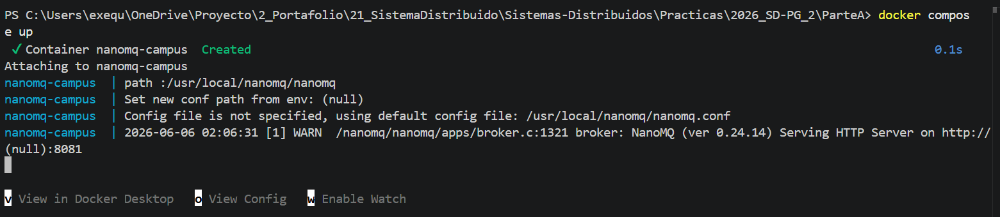
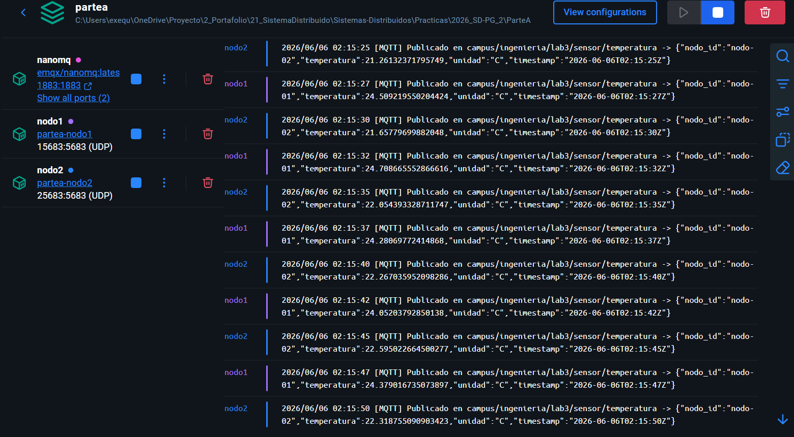
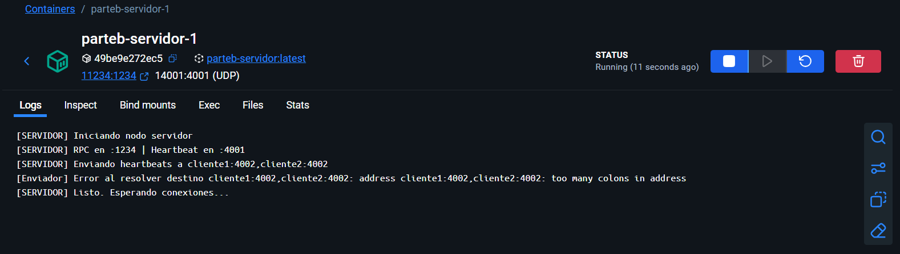
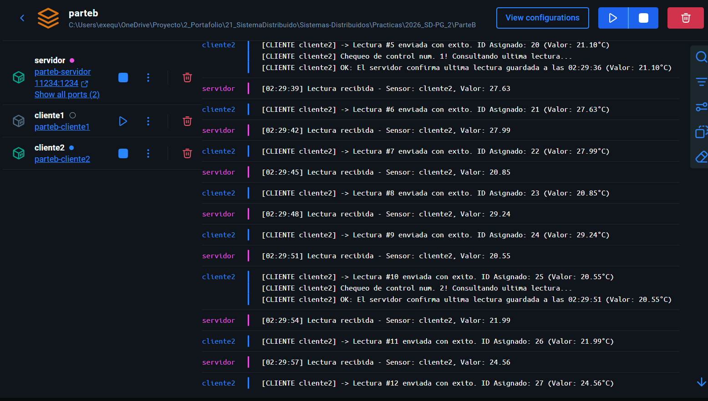

# Servidor de Broadcast Concurrente

Proyecto base para la Clase sobre Sockets de Sistemas Distribuidos.

## Integrantes

- Pavón, Juan Gabriel
- Ruthlein, Francisco Martín
- Exequiel Andres Diaz

### Parte A

#### Conexion con servidor

#### Conexion con nodos

### Parte B

#### Conexion con nodos

